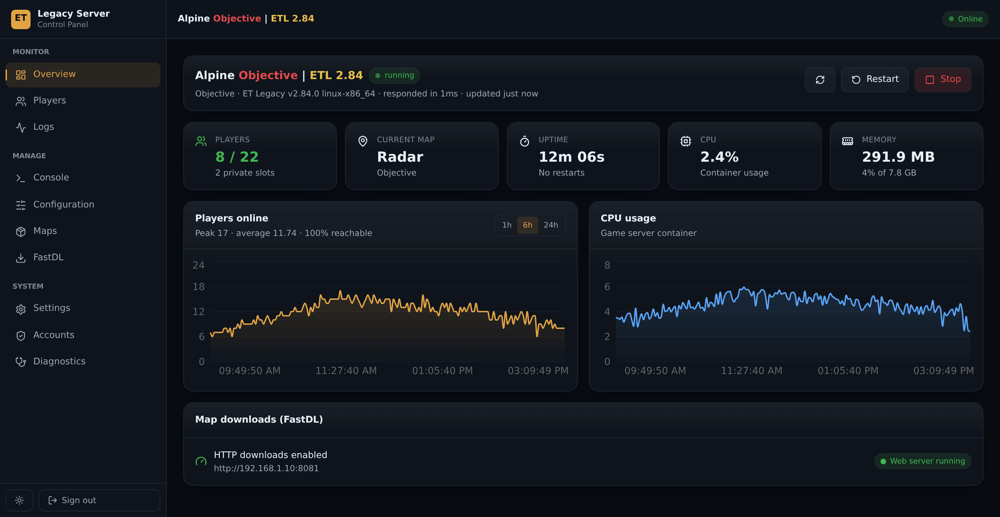
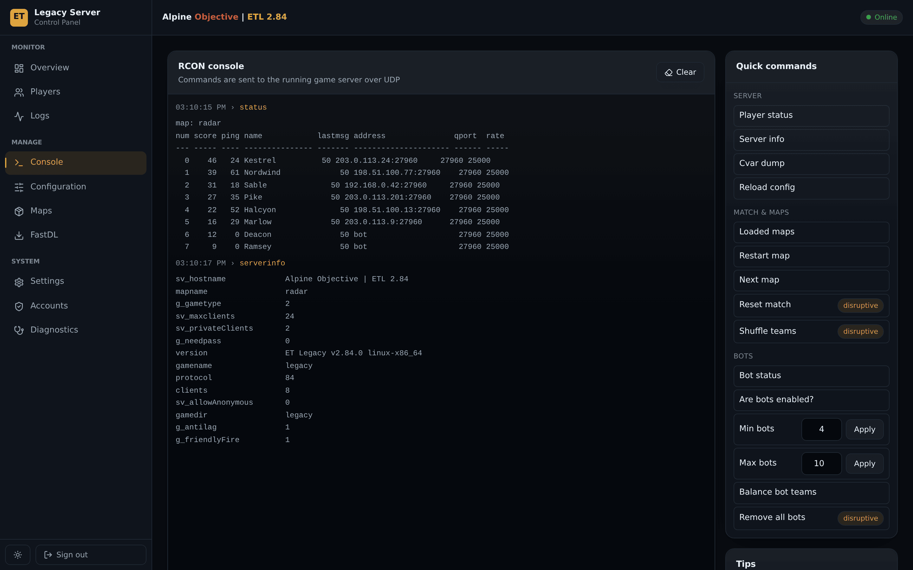
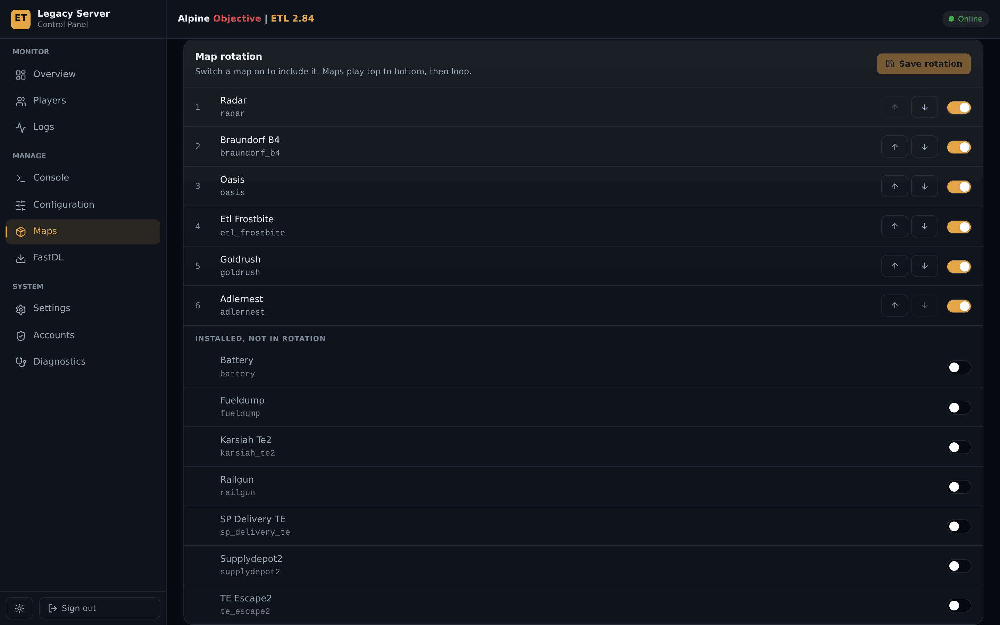

# ET: Legacy Control Panel

A self-hosted control panel for a Wolfenstein: Enemy Territory (ET: Legacy) game
server running in Docker. Monitor players in real time, start and stop the
server, edit the server config safely, manage custom maps, and run an optional
HTTP download (FastDL) server — all from a browser on your LAN.

It is plain Docker Compose and runs anywhere Docker does — a NAS, a home server,
a VPS, or a spare machine. No prior experience of running an ET server is
assumed: the control panel writes a working config for you, and everything after
that is done in the browser.



The screenshots on this page come from a demo server with invented players and
addresses; the rest appear beside the features they belong to under
[Using the control panel](#using-the-control-panel).

Ready-built images, no account needed:

| Image | Purpose |
|---|---|
| [`mbgroen/etl-control-panel`](https://hub.docker.com/r/mbgroen/etl-control-panel) | This control panel |
| [`mbgroen/etl-fastdl`](https://hub.docker.com/r/mbgroen/etl-fastdl) | HTTP map downloads for clients |

The game server itself comes from the official
[`etlegacy/server`](https://hub.docker.com/r/etlegacy/server) image.

---

## Contents

- [What it does](#what-it-does)
- [Architecture](#architecture)
- [Prerequisites](#prerequisites)
- [Quick install](#quick-install)
- [Publishing your own images](#publishing-your-own-images)
- [Installation](#installation)
- [Configuration reference](#configuration-reference)
- [Using the control panel](#using-the-control-panel)
- [FastDL — HTTP map downloads](#fastdl--http-map-downloads)
- [Security](#security)
- [API reference](#api-reference)
- [Troubleshooting](#troubleshooting)
- [Development](#development)

---

## What it does

| Area | Capabilities |
|---|---|
| **Monitoring** | Live player list with scores, ping and colour-coded names; current map; CPU, memory and uptime; 8-hour activity history |
| **Control** | Start / stop / restart the game server container; kick and ban from the Players page |
| **Console** | Full RCON console with command history, plus one-click commands for the match, the bots and the config |
| **Logs** | Live-streamed container logs — game server or FastDL — with filtering, pause-and-buffer, follow-tail, and a download that saves a deeper tail than the pane holds |
| **Configuration** | Around 190 settings in guided forms — every server-side cvar ET: Legacy 2.84 reads that is worth setting — with search, a map-rotation builder, a raw editor with validation, and timestamped backups you can delete |
| **Maps** | Upload `.pk3` packages, see the maps inside each one, and switch any of them into the rotation — all on one page |
| **FastDL** | Enable/disable HTTP downloads in one action — starts the web server *and* writes the matching cvars — with a reachability test |
| **Players** | Who is playing — with slot, score, ping and one-click kick and ban — and who has played — duration, address and country with a flag, kept across restarts. Bot visits are hidden by default and can be deleted in one action |
| **Settings** | Upload limit, and how many config backups and player visits to keep |
| **Accounts** | Several administrators, each with their own login — add, remove, and set a password for someone who has lost theirs |
| **Diagnostics** | Every dependency checked, each failure paired with the fix |

The UI is keyboard-navigable, screen-reader labelled, responsive down to phone
width, and ships light and dark themes.

---

## Architecture

```
                        ┌───────────────────────────────┐
   browser ──HTTP/WS───▶│  etl-control-panel      :8085 │
                        │  Node 22 · Express · React    │
                        └──┬──────────┬─────────────┬───┘
                           │          │             │
              docker.sock  │          │ UDP 27960   │ read / write
                           ▼          ▼             │
                  ┌────────────┐ ┌──────────┐       │
                  │   Docker   │ │etl-server│       │
                  │   daemon   │ │ the game │       │
                  └────────────┘ └────┬─────┘       │
                                      │ writes      │
              ┌───────────────────────▼─────────────▼─────────────────────┐
              │  <data>/                                                  │
              │    etl-server/etmain/    maps and the server config       │──┐
              │    etl-server/legacy/    mod data                         │──┤
              │    etl-server/homepath/  etl.db, logs, archived cvars     │  │
              │    etl-control-panel/    accounts, backups, visit history │  │
              └───────────────────────────────────────────────────────────┘  │
                                                                             │
                              ┌──────────────────┐   etmain and legacy only, │
                              │ etl-fastdl :8081 │◀──────── read-only ───────┘
                              │ nginx            │
                              └──────────────────┘
```

Three containers on one bridge network:

- **`etl-server`** — the game server, unchanged from the official image.
- **`etl-control-panel`** — this project. Talks to the Docker daemon for
  container lifecycle and logs, to the game server over UDP for status and
  RCON, and to the bind-mounted data directories for config, maps and its own
  state.
- **`etl-fastdl`** — nginx serving `etmain/` and `legacy/` read-only over HTTP.
  Optional; the control panel starts and stops it on demand.

The control panel and FastDL both mount **the same host directories** the game
server uses. There is no copying or syncing: what the server has installed is
exactly what the control panel lists and what clients can download.

Two of those four directories are worth knowing individually. `homepath/` is
where the game server keeps its XP database, its logs and the cvars it archives
itself — it must be mounted or an image update wipes them, and it must be owned
by uid 1000 or the server cannot write to it. And FastDL mounts **only**
`etmain/` and `legacy/`: neither `homepath/` nor the control panel's own
directory is inside the container that faces the internet, so the credential
store and the database are not merely unserved, they are absent.

---

## Prerequisites

- **Docker Engine 20.10+** and the **Docker Compose v2** plugin.
- **A host directory for persistent data**, on a data disk rather than the OS
  disk.
- **UDP port 27960** reachable by players (port-forwarded on your router if the
  server should be public).
- **TCP port 8085** for the control panel (moved off the much-contended 8080;
  change it with `CONTROL_PANEL_PORT`), and **8081** if you use FastDL.
- Roughly **400 MB of disk** for the images, plus whatever your maps need.
- **The base game data** — `pak0.pk3`, `pak1.pk3`, `pak2.pk3` and `mp_bin.pk3`.
  The server image does not ship these and cannot start a map without them; see
  [Adding the base game files](#adding-the-base-game-files).

> **Upgrading an existing server?** This stack manages the same `etmain`
> directory your current server uses. Point `COMPOSE_DATA_PATH` at your existing
> data location and your maps and config carry over untouched.


---

## Quick install

The fastest route: **no source checkout and no build.** One compose file, one
command, and the rest of setup happens in the browser.

It uses pre-built images from Docker Hub — see
[Publishing your own images](#publishing-your-own-images) to build them from
this repository under your own account.

### 1. Get the compose file

Download [`deploy/docker-compose.yml`](deploy/docker-compose.yml) to an empty
directory on the host — that single file is the whole install.

```bash
mkdir -p ~/etl && cd ~/etl
curl -fsSLO https://raw.githubusercontent.com/mbgroen/etl-control-panel/main/deploy/docker-compose.yml
```

### 2. Choose where data lives

Every service keeps its data under one directory, `COMPOSE_DATA_PATH`. It
defaults to `./data` beside the compose file, which is fine for a trial. For a
real install put it on your data disk:

```bash
echo 'COMPOSE_DATA_PATH=/srv/appdata' > .env
```

Leave `RCON_PASSWORD` blank. It is optional — you set the RCON password on the
Configuration page in step 5, and the control panel reads it from the server config
from then on.

> **Using a Docker management UI?** Many — Portainer, Dockge, the compose
> plugins built into NAS operating systems — let you paste a compose file
> instead of using a shell, and some substitute their own data directory into
> it. Replace
> `${COMPOSE_DATA_PATH:-./data}` with whatever token that UI expects, or set
> `COMPOSE_DATA_PATH` in its environment box. The directory layout underneath is
> what matters, not how the path gets there.

### 3. Start it

```bash
docker compose up -d
```

### 4. Create your account

Open **`http://<host-ip>:8085`**. The control panel asks you to create an
administrator account — this replaces generating a password hash on the command
line. Do it straight away: until you do, anyone who can reach that port can
claim the control panel.

### 5. Create the server config

Go to **Configuration**. On a fresh install there is no config file yet, so the
page offers **Create default configuration** — a working objective server with a
six-map rotation. Set your server name, RCON password and private-slot password
there.

The RCON password you set here is picked up by the control panel automatically —
there is nothing to copy into the compose file and nothing to restart. See
[The RCON password](#the-rcon-password).

### 6. Add the base game files

If `etmain` is empty, do [Adding the base game files](#adding-the-base-game-files)
now — the server cannot load a map without them. Skip this if you pointed
`COMPOSE_DATA_PATH` at an existing installation.

### 7. Check it over

**Diagnostics** verifies the Docker socket, container names, config path and
RCON, and names the fix for anything that is wrong.

That's the whole installation. Map uploads, FastDL and rotation are all managed
from the interface.

> **Note on privileges.** This compose runs the control panel as root so it can use
> the Docker socket and write the game data directory regardless of ownership —
> which is what removes the `PUID`/`PGID`/`DOCKER_GID` lookups from setup. The
> socket is already root-equivalent, so this adds little on top of mounting it.
> For the unprivileged variant, see the root `docker-compose.yml`, which pins a
> user and adds the host's docker group instead.

---

## Releases

Every version tag gets a [GitHub release](https://github.com/mbgroen/etl-control-panel/releases)
whose notes are the commit message for that tag — written once, published by CI
after the images are on Docker Hub, so a release never points at a version you
cannot pull.

Version numbers mean what they say:

| | Bumped when |
|---|---|
| **Major** | You have to change something before upgrading — image or container names, paths, the compose contract |
| **Minor** | A new capability |
| **Patch** | Fixes, wording and documentation. Nothing new to learn |

A patch or minor upgrade is always safe to take with `docker compose pull`; a
major one is worth reading the release note first.

---

## Publishing your own images

You do not need to — the images above are public and ready to use. Publish your
own if you want to modify the control panel, or would rather not depend on someone
else's registry account.

The repository ships a GitHub Actions workflow that builds both images and
pushes them to Docker Hub. The build runs on GitHub's machines, so it does not
matter what you develop on: the image is built for the target platform
regardless of your own computer's architecture.

It targets `linux/amd64` by default, which is what nearly every NAS and server
runs. Building `arm64` as well means emulating it through QEMU on GitHub's
runners — roughly triple the build time — so it is opt-in: pick a different
platform set from the **Run workflow** menu. Check what your server needs by
running `uname -m` **on the server**, not on your own machine:

| `uname -m` says | Build for | Typical hardware |
|---|---|---|
| `x86_64` | `linux/amd64` (default) | Intel/AMD NAS, most home servers, VPS |
| `aarch64` | `linux/arm64` | Raspberry Pi 4/5, ARM VPS, some newer NAS |

1. On Docker Hub: **Account settings → Personal access tokens → Generate new
   token**, permission **Read & Write**. Copy it.
2. On GitHub: **repo → Settings → Secrets and variables → Actions → New
   repository secret**, twice:
   - `DOCKERHUB_USERNAME` — your Docker Hub username
   - `DOCKERHUB_TOKEN` — the token from step 1
3. Tag a release and push the tag:

```bash
git tag v1.0.0 && git push origin v1.0.0
```

It typechecks, runs the tests, then publishes two tags per image:

```
<username>/etl-control-panel:1.0.0     the exact version — never moves
<username>/etl-control-panel:latest    the newest release
```

**Pushing to `main` publishes nothing.** Images are built for releases only, so
one exists for every version someone chose to publish and for nothing else.
That also means a documentation commit no longer rebuilds and republishes
`latest` for no reason.

`latest` follows the *highest* version tag. Publishing an older tag — a
backport, or a rebuild of something historical — leaves `latest` alone rather
than quietly pulling it backwards.

To publish without tagging, use **Run workflow** on the Actions tab; a manual
run is treated as deliberate and does move `latest`.

Then update the two `image:` lines in
[`deploy/docker-compose.yml`](deploy/docker-compose.yml) to your username. To
upgrade later:

```bash
docker compose pull && docker compose up -d
```

---

## Installation

Manual installation, building from source. Use this if you want to modify the
code or would rather not depend on a registry.

### 1. Get the files onto the host

```bash
cd /srv/appdata          # wherever you keep persistent data
git clone https://github.com/mbgroen/etl-control-panel.git
cd etl-control-panel
```

### 2. Create the data directories

```bash
# Substitute your own data path
export DATA=/srv/appdata

mkdir -p "$DATA"/etl-server/{etmain,legacy,homepath} "$DATA"/etl-control-panel

# The game server runs as uid 1000 and writes its XP database and logs here
chown -R 1000:1000 "$DATA"/etl-server/homepath
```

Two directories, deliberately siblings:

```
$DATA/
├── etl-server/               game data
│   ├── etmain/             maps and server config    (served over HTTP)
│   ├── legacy/             Legacy mod data           (served over HTTP)
│   └── homepath/           XP database, game and attack logs, archived cvars
└── etl-control-panel/        admin accounts, config backups, player history
```

The split is the point: FastDL is the service you publish to the internet, and
it only ever mounts `etmain/` and `legacy/` — never `homepath/`, which holds the
database, or the control panel's own directory. Keeping control panel state out of that
tree means the credential store is not merely blocked from being served — it is
not present in the container at all.

### 3. Install a server config

```bash
cp config/etl_server.cfg.example "$DATA"/etl-server/etmain/etl_server.cfg
```

Open it and change at least `sv_hostname`. Passwords are empty by default and
are best set on the control panel's Configuration page, which applies the RCON
password to the running server for you.

### 4. Credentials (optional)

You can skip this entirely — leave `ADMIN_PASSWORD_HASH` and `SESSION_SECRET`
empty and the control panel will ask you to create an account on first visit.

To manage them declaratively instead, build the image and use the generator:

```bash
docker compose build control-panel
docker compose run --rm --no-deps --entrypoint node control-panel dist/cli/hashPassword.js
```

It prompts for a password and prints an `ADMIN_PASSWORD_HASH` and a random
`SESSION_SECRET`. Values set in the environment take precedence over any account
created through the wizard.

### 5. Fill in the environment

```bash
cp .env.example .env
nano .env
```

The values you must set are `COMPOSE_DATA_PATH`, `ADMIN_PASSWORD_HASH`,
`SESSION_SECRET`, and `RCON_PASSWORD`. Find the two ID values like this:

```bash
# GID of the docker group — lets the control panel use the socket unprivileged
getent group docker | cut -d: -f3

# Owner of your etmain directory — the control panel must be able to write here
stat -c '%u %g' "$DATA"/etl-server/etmain

# The game server's home directory must be owned by uid 1000, or it cannot
# write its XP database — and says nothing when it cannot
stat -c '%u %g' "$DATA"/etl-server/homepath
```

Put the first two in `DOCKER_GID`, and `PUID`/`PGID` respectively. Diagnostics
checks the last one for you and names the fix if it is wrong.

> **`$` in the hash:** bcrypt hashes contain `$`. Docker Compose does not expand
> variables inside a `.env` file, so pasting it plainly is fine. If you export it
> from a shell instead, single-quote it.

### 6. Start

```bash
docker compose up -d
docker compose ps
```

Open **`http://<host-ip>:8085`** and sign in.

Go to **Diagnostics** first — it verifies the Docker socket, the container
names, the config path and the RCON credentials, and tells you how to fix
anything that is wrong.

### Installing through a Docker management UI

If you drive Docker from a web interface rather than a shell, paste
`docker-compose.yml` into its compose editor and put the contents of your `.env`
into its environment box — most write that out as the `.env` beside the compose
file. Set `COMPOSE_DATA_PATH` there like any other variable.

Two things catch people out with this route:

- Some UIs substitute their own configured data directory into compose files via
  a placeholder token. This project uses the standard `${COMPOSE_DATA_PATH}`
  instead, so set that variable to the same path rather than looking for the
  token.
- The `fastdl/nginx.conf` bind mount is relative to the compose file. If the UI
  stores that file somewhere other than this checkout, either clone the repo
  next to it or change the volume line to an absolute path. The quick install
  avoids this entirely — its FastDL image has the config baked in.

---

## Configuration reference

All settings are environment variables; see `.env.example` for the annotated
list. The ones that matter most:

| Variable | Default | Notes |
|---|---|---|
| `COMPOSE_DATA_PATH` | — | **Required.** Host directory holding `etl-server/` (game data) and `etl-control-panel/` (control panel state) |
| `ADMIN_USERNAME` | `admin` | Control panel login |
| `ADMIN_PASSWORD_HASH` | empty | Optional. Empty ⇒ first-run wizard in the browser |
| `SESSION_SECRET` | empty | Optional. Generated and persisted when empty |
| `RCON_PASSWORD` | empty | **Optional override.** Used only when the server config has no `rconpassword` of its own — see [The RCON password](#the-rcon-password) |
| `COOKIE_SECURE` | `false` | Set `true` **only** behind HTTPS — otherwise sign-in silently fails |
| `SERVER_CONFIG_NAME` | `etl_server.cfg` | Filename the game server execs, inside `etmain` |
| `FASTDL_BASE_URL` | empty | Pre-fills the FastDL URL field. Must be reachable **by players** |
| `PUID` / `PGID` | `1000` / `100` | Must be able to write `etmain` |
| `DOCKER_GID` | `999` | Host `docker` group GID |
| `POLL_INTERVAL_SEC` | `10` | Status poll frequency |
| `GEO_LOOKUP` | `true` | Resolve player addresses to a country. The only outbound request the control panel makes; private addresses are never sent |
| `SESSION_TTL_HOURS` | `12` | How long a sign-in lasts |
| `PORT` | `8080` | Port inside the container. The compose files publish 8085 in front of it |
| `LOG_LEVEL` | `info` | `debug` when you want to see every request |
| `SERVER_HOME_PATH` | `/data/etl-server/homepath` | The game server's home directory as the panel sees it. Only read to check that the server can write there |
| `LEGACY_PATH` | `/data/etl-server/legacy` | Mod directory, used to report what FastDL can serve |
| `ETL_HOST` / `ETL_PORT` | `etl-server` / `27960` | How to reach the game server for status and RCON |
| `FASTDL_CONTAINER` | `etl-fastdl` | Container the FastDL page starts and stops |
| `DOCKER_SOCKET` | `/var/run/docker.sock` | Where the Docker API is mounted |
| `RCON_TIMEOUT_MS` | `2000` | How long to wait for an RCON reply before giving up |
| `HISTORY_POINTS` | `2880` | Samples kept for the activity graph — eight hours at the default poll interval |
| `MAX_UPLOAD_MB` | `256` | *Initial* per-file `.pk3` upload limit. Change it under **Settings**; once set there, the stored value wins |

### Adding the base game files

The `etlegacy/server` image contains the engine and the Legacy mod, but **no
game data** — its `etmain` holds only config templates. Enemy Territory's own
assets are a separate thing, and without them the server starts and then dies
with `Loaded entities from maps/…` failures or an empty map list.

Four files are needed, from the `etmain` directory of any Wolfenstein: Enemy
Territory installation:

```
pak0.pk3     ~229 MB
pak1.pk3     ~50 KB
pak2.pk3     ~88 KB
mp_bin.pk3   ~1.6 MB
```

ET has been freeware since 2003, so you do not need to own anything: the full
game is a free download from Splash Damage or the ET: Legacy site. Copy them out
of an existing install or a fresh download — a desktop client works fine, since
these are the same files.

**You can upload them from the control panel.** Go to **Maps → Add map
packages** and drop all four in. The default upload ceiling is 256 MB, which
`pak0.pk3` fits under, and uploads are written world-readable so FastDL can
serve them straight away. If you would rather copy them in over the shell, put
them in `<data path>/etl-server/etmain/` and make them readable:

```bash
chmod o+r <data path>/etl-server/etmain/*.pk3
```

Either way, **restart the game server afterwards** — the engine indexes pk3
files at start-up, so files added while it is running are not seen:

```bash
docker compose restart etl-server
```

### The RCON password

**Set it on the Configuration page and nothing else is required.** The server
config is the single source of truth: the control panel reads `rconpassword` from
the same file the game server does, so the two cannot drift apart.

Changing it is safe while the server is running. On save, the control panel moves
the live server onto the new password *using the old one, while it is still
valid*, so the file, the running server and the control panel all change together —
no restart, and no window where the console locks you out. The save reports
what happened, including when it could not do the handover (server offline, or
no previous password to authenticate with) and what remains to be done.

`RCON_PASSWORD` is now **optional**. Set it only if the control panel cannot read
the config, or if you would rather keep the secret out of a file the UI can
display; it is used when the config has no `rconpassword` of its own. If both
are set to different values the config wins, and Diagnostics says so rather
than leaving you to work out which one is in play.

Diagnostics checks the credential by actually authenticating against the running
server, so "RCON credentials: ok" means commands will work — not merely that a
password is set somewhere.

> **Upgrading from an earlier version?** Nothing to do. An existing
> `RCON_PASSWORD` keeps working exactly as before. You can delete it once
> `rconpassword` is set in the config, and Diagnostics will confirm which source
> is in use.

---

## Using the control panel

> **New to ET servers? What RCON is.** "Remote console" is the game engine's
> own admin channel: you send a password plus a command over the network, and
> the server runs it as though it had been typed at its console. It is what
> kicking, banning, changing map and reading the live player list all go
> through. Set `rconpassword` on the **Configuration** page and the control panel
> handles the rest — it reads the password from the config, so there is nothing
> to copy anywhere and no restart. Without it the control panel still shows status
> and manages files; only the live-control features are unavailable.

**Overview** — status, trends, and the start/stop/restart controls. It shows
how many people are playing, not who: the list, the detail and the admin
actions all live on Players, so there is one place to look and one place where
a kick can be issued.

**Console** — a real RCON console. Arrow keys recall history. Note that
commands typed here change the *running* server only; they are lost on restart.
Use Configuration to make a change permanent.



**Logs** — live container output, from the game server or from FastDL.
Auto-scroll releases the moment you scroll up to read something, and pausing
buffers rather than drops lines. **Download** saves the last 10,000 lines as a
`.log` file — more than the pane keeps, because the reason to save a log is
usually something that happened before you thought to look.

The game server colours its console with terminal escape codes, one pair around
every player name. A browser is not a terminal, so those are stripped on the way
through; without that, `Harde Henk entered the game` arrives as a line of
replacement boxes and `[0m` fragments.

The FastDL log has one line per request — who asked, for which file, the status,
the bytes that actually went out and how long it took:

```
203.0.113.24 "GET /etmain/radar.pk3 HTTP/1.1" 200 24117248/24117584 bytes in 3.412s "ET"
```

That is the only place that confirms a client really fetched a map over HTTP.
The game server's own log says it *redirected* the client — `Redirecting client
'…' to http://…/etmain/….pk3` — which is a statement about what it told the
client to do, not about what happened next.

**Configuration** — four views over one file:


- *Settings* — guided fields for the cvars people actually change, in eighteen
  sections from Identity to Protection. Each says whether it applies
  immediately, at the next map, or needs a restart.

  Clearing a numeric field removes the setting from the file rather than writing
  an empty value, and the field says so before you save. That is the only way to
  hand a cvar back to the engine, and writing empty instead is worse than it
  looks: the engine reads it as 0, and 0 in the respawn interval is a division
  by zero.

  A setting the config does not mention shows the value the **server** is using
  — as a greyed placeholder in a text or number field, dimmed with a *default*
  chip on a switch — never as something that looks saved. **Only my settings**
  filters the form down to what your config actually contains, which at around
  190 fields is the only practical answer to "what have I changed?". That distinction
  matters more than it sounds: every `vote_allow_*` except referee and time
  limit defaults to on, so a form that drew them as off told you the opposite of
  the truth. Defaults come from `g_cvars.c` and the engine's own `Cvar_Get`
  calls at v2.84.0 — and where both register a cvar the engine wins, because it
  registers first and `Cvar_Get` keeps the value an existing cvar already has.

  Some settings only do anything in one game type, and the mod reads them
  behind a `g_gametype` test — set them in another mode and you have changed a
  cvar and nothing else. Those carry a scope badge (*Last Man Standing only*,
  *Not in Stopwatch or Last Man Standing*), which turns amber when your
  configured game type is not one of them, and the two sections that exist for a
  single mode — Last Man Standing and Map voting — say so across the whole
  panel. Nothing is hidden: they are still your settings, still saved, and they
  start working the moment you switch. The badges follow the **Game type** field
  as you change it, so you can see what a mode costs before you commit to it.

  `g_gametype` is latched. Saving it does not change the running server — the
  browser, the Overview page and the game itself all keep reporting the old mode
  until the next map loads. When the two disagree the Game type field says which
  one is running and what will make it take effect, because "I set Campaign and
  it still says Objective" otherwise looks like the control panel ignoring you.

  Three levels of detail, because "everything at once" is not a form anyone can
  read: the plain view holds what most servers touch, **Show advanced** adds the
  rest, and **Expert** — inside advanced — adds bots, Lua modules and the
  file paths the server reads at start-up. Those last ones do not tune a server
  when they are wrong; they stop it booting, so they are not one mis-click from
  the round timer. Search ignores all three levels and finds everything.
- *Raw file* — the whole config, validated as you type. Always the source of
  truth; the other views only patch it.
- *Backups* — every save is snapshotted first, selectable, deletable and
  downloadable; the running config downloads from the raw editor. A backup you
  cannot take off the machine is only half a backup — so one you have taken off
  it can be put back: **Restore from file** validates the .cfg, shows you its
  name and any problems, and takes a snapshot of what it replaces. How
  many are kept is set under **Settings**; they are plain files you can also
  recover with `cp`.

Password fields are masked, with a reveal button so you can check what you
typed. Leaving one untouched leaves it unchanged.

Bitmask cvars — `g_xpSaver` is the one most people meet — are a row of
checkboxes rather than a number, with the total shown beside them. A guide that
says "set it to 15" is really asking you to switch four things on, and one that
says "set it to 1" switches three of them back off; here you can see which.
Bits this control panel does not name are preserved rather than cleared, so a newer
server's flags survive a save.

Be aware that the raw config — passwords included — is sent to the browser, as
it must be for the raw editor to work. Anyone who can sign in to the control panel
can read every password in the server config, exactly as they could by opening
the file on the host. The masking is there to keep secrets off the screen in
passing, not to withhold them from an administrator.

**Players** — who is connected now and who has been, with how long they stayed
and where they connected from. The game server itself keeps no history, so this
is the only place that can answer "has anyone been using my server?".


A visit is identified as a bot by the address the server reports for it — the
literal string `bot`. Addresses come from rcon, so a visit recorded before rcon
could be reached carries none, and nothing can say afterwards whether it was a
bot; the page says how many such visits it holds rather than quietly offering no
filter.

Country comes from the player's address. Private addresses on your own network
are labelled as such rather than looked up — nothing about your LAN is sent
anywhere. Public addresses are resolved through **ipwho.is**; only the address
is sent, never a player name. Turn it off by setting `GEO_LOOKUP=false`, and the
page still works, without countries.

**Maps** — uploading, the rotation and the library, in the order the work
happens.

The rotation editor sits directly under the uploader, listing **every installed
map** with a switch: on to include it, off to drop it, arrows to order it.
Upload a pk3 and its maps appear there immediately — **switched off**, because
adding a file should never silently change what the server plays next.



Map names are read from the `maps/*.bsp` entries inside each archive, which
matters because a pk3 is often named nothing like the map inside it:
`mapbundle.pk3` may hold `braundorf_b4` and `frostbite`. Previously finding that
out meant asking the server over RCON and retyping the name on another page.

A map in the rotation whose pk3 is no longer installed is marked *file missing*
rather than quietly dropped — the rotation is yours to change, not ours.

The rotation is edited here and nowhere else.

**Two game types do not use it.** In **Campaign** the engine takes the next map
from the campaign file and never runs `vstr nextmap` at all, so the rotation
sits unused until you switch back. Under **Map voting** the players choose at
intermission and the rotation is only the fallback for a round nobody voted in.
The rotation panel says so when the server is playing either of them, rather
than letting you order a list the server has no intention of reading.

**FastDL** — its own page, and the only place download settings live. Enabling
writes `sv_allowDownload`, `sv_wwwDownload`, `sv_wwwBaseURL` and
`sv_wwwDlDisconnected` for you; below that sit the settings the button does not
touch — the fallback mirror and the limits on the slow in-game transfer that
clients fall back to.

Those used to be duplicated in a Downloads section under Configuration, which
meant two screens claiming to own one setting: editing the base URL there left
this page reporting a state it no longer had, and the screen people found first
was the one that could not start the container. Searching Configuration for
`sv_wwwBaseURL` now points here instead of coming up empty.

It serves the same directory the map library manages, but that is a fact about
the implementation: installing maps happens often, setting up downloads happens
roughly once.

The game server writes more than its config: the XP database (`etl.db`), the
game and attack logs, and the cvars it archives itself all go to its home
directory, kept at `<data>/etl-server/homepath`. Without that mount they live
in the container and vanish on the next `docker compose pull` — XP saving that
survives a week of play but not an image update is worse than none.

The game server runs as **uid 1000**, and a bind-mounted directory keeps the
host's ownership, so create it before the first start:

```bash
mkdir -p "$COMPOSE_DATA_PATH/etl-server/homepath"
chown -R 1000:1000 "$COMPOSE_DATA_PATH/etl-server/homepath"
```

Diagnostics checks exactly this and names the fix if it is wrong, because a
server that cannot write there says nothing about it.

**Settings** — the control panel's own preferences, kept apart from the game
server's config: the upload limit, and how many config backups and player visits
to retain. Nothing here is a cvar, none of it is touched by restoring a config
backup.

**Accounts** — the administrators who can sign in. Add one per person rather
than sharing a login: when someone stops helping run the server you remove their
account instead of changing a password and redistributing it. Removal takes
effect on their next request, not when their session would have expired.

There are no roles. Anyone who can sign in can restart the game server and read
the config, so a "read-only" tier would suggest a boundary this control panel cannot
enforce. Set someone's password for them if they lose it — you are not asked for
their old one — while changing your own still requires the current password.

If `ADMIN_PASSWORD_HASH` is set in the environment, that account is the only one
and this page says so: environment values are authoritative on purpose, so an
operator who declares credentials in compose cannot have them silently
overridden. Remove the variable to manage accounts from the control panel.

**Diagnostics** — dependency checks and the exact remedy for each failure.

---

## FastDL — HTTP map downloads

Without FastDL, a player missing a custom map downloads it through the game's
UDP channel at roughly 100 KB/s. A 60 MB map pack takes ten minutes and usually
times out. With FastDL the client fetches it over HTTP at full line speed.

**To enable:** *FastDL → Public base URL → Enable HTTP downloads.*

The base URL must be the address **players** can reach — your LAN IP or public
hostname with the FastDL port. Not `localhost`, and not a Docker service name.

```
http://192.168.1.10:8081        LAN only
http://et.example.com:8081      internet (forward TCP 8081 on your router)
```

Enabling does three things at once, which is the point: it starts the nginx
container, sets `sv_wwwDownload 1` and `sv_wwwBaseURL`, and leaves
`sv_allowDownload` on as a fallback. Half of that configuration is the usual
cause of downloads that mysteriously fail.

Then press **Test connection** — it fetches a real `.pk3` through the public URL
exactly as a client would, and compares the size against the file on disk.

Clients request `<base URL>/etmain/<map>.pk3`. nginx serves **only** `.pk3`
files from `etmain` and `legacy`; configs, logs and ban lists in the same
directory are not reachable.

Restart the game server (or run `exec etl_server.cfg` in the console) so it
picks up the new download settings.

**The mod package matters as much as the maps.** A client whose ET: Legacy
build differs from the server's must download that build's pk3 —
`legacy/legacy_v2.85.0.pk3` and successors — exactly as it downloads a map. That
file ships *inside* the game server image, and the `legacy/` directory FastDL
serves is on the host, so out of the box the request 404s: the engine falls back
to its in-game transfer and 34 MB at `sv_dlRate` is minutes of a progress bar
that most players abandon. The server stays listed and answering the whole time,
and simply keeps nobody.

The control panel copies that file out for you — on start-up, and after it
starts or restarts the game server, so an image update publishes the new version
by itself. *FastDL → Mod package* shows what is published and can redo it, and
Diagnostics fails the check if it is missing.

**Did a client actually download?** *Logs → FastDL* answers that: nginx records
every request there, with the status and the bytes it sent. The game server's
log only shows that it *redirected* the client to the FastDL URL, which is not
the same claim.

If that log shows nothing but `start worker process` lines, the FastDL image
predates 1.14.0, where nginx wrote its access log to a file inside the container
that nothing ever read. `docker compose pull fastdl && docker compose up -d
fastdl` fixes it.

---

## Security

**This control panel is not built to face the public internet.** Run it on your LAN,
or behind a VPN or an authenticating reverse proxy.

- **The Docker socket is mounted.** That is equivalent to root on the host. The
  control panel refuses to touch any container except the two it is configured to
  manage, but the socket itself is the trust boundary. For a hardened setup, put
  a socket proxy such as `tecnativa/docker-socket-proxy` in front of it and
  grant only `CONTAINERS=1`, `POST=1`.
- **Run behind TLS if it leaves your LAN**, and set `COOKIE_SECURE=true` when
  you do.
- **PunkBuster is gone.** ET: Legacy dropped it — the browser even hides
  PunkBuster servers — and the service behind it has been dead for years. What
  replaces it is server-side: `sv_pure` against modified pk3 files,
  `g_guidCheck` against clients without a valid GUID, and `sv_wh_active`, which
  stops sending the positions of players you cannot see so a wallhack has
  nothing to draw. All three are under Configuration; only the last costs CPU.
  Client-side cvar rules (`sv_cvar cl_maxpackets IN 60 125`) can go in the
  config file, but they are checked by the client, so treat them as a guardrail
  rather than a defence.
- **RCON is cleartext UDP** — that is the protocol, not this implementation.
  Keep the game server and control panel on the same host or a trusted network.
- Sessions are httpOnly, `SameSite=Strict` JWT cookies. Login is rate-limited
  to 10 attempts per 10 minutes per IP; the RCON endpoint to 60/minute.
- Every request re-checks that the signed-in account still exists, so removing
  an administrator ends their session immediately rather than whenever their
  cookie would have expired.
- Give each administrator their own account under **Accounts**. Shared logins
  cannot be revoked for one person, and the audit trail in the logs is only as
  precise as the usernames in it.
- Uploads accept only `.pk3` filenames matching a strict pattern, are written to
  a temp directory first, and cannot escape `etmain`.
- Secrets are masked in API responses and redacted from logs.

**Rotate any password that has been shared or committed.** If a config with real
passwords in it has ever been pasted into a chat, an issue tracker, or a public
repository, change `rconpassword` and `sv_privatePassword` and update `.env`.

---

## API reference

Everything the UI does is available over REST. All endpoints require the session
cookie from `POST /api/auth/login`; all responses are JSON, and errors share one
envelope:

```json
{ "error": { "code": "config_conflict", "message": "…", "details": {} } }
```

<details>
<summary><strong>Endpoints</strong></summary>

### Authentication
| Method | Path | Purpose |
|---|---|---|
| `GET` | `/api/auth/status` | Whether setup has been done — the only unauthenticated endpoint besides `/healthz` |
| `POST` | `/api/auth/setup` | First-run: create the first administrator |
| `POST` | `/api/auth/login` | `{username, password}` → sets session cookie |
| `POST` | `/api/auth/logout` | Clears the session |
| `GET` | `/api/auth/session` | Current user, or 401 |
| `GET` | `/api/auth/accounts` | Every administrator, plus the minimum password length |
| `POST` | `/api/auth/accounts` | `{username, password}` → adds an administrator |
| `DELETE` | `/api/auth/accounts/:id` | Removes one. Refuses your own and the last remaining account |
| `POST` | `/api/auth/accounts/:id/password` | `{password}` → sets someone else's password |
| `POST` | `/api/auth/password` | `{currentPassword, newPassword}` → changes your own |

### Server
| Method | Path | Purpose |
|---|---|---|
| `GET` | `/api/server/status` | Full snapshot: container, resources, game status |
| `POST` | `/api/server/lifecycle` | `{service, action}` — `start` / `stop` / `restart` |
| `GET` | `/api/server/players` | Player list; detailed (with slots) when RCON is configured |
| `POST` | `/api/server/players/action` | `{slot, action, reason}` — `kick` / `ban` / `mute` / `unmute` |
| `GET` | `/api/server/history?minutes=&points=` | Activity samples and summary |

### Console
| Method | Path | Purpose |
|---|---|---|
| `POST` | `/api/console/rcon` | `{command}` → server output |
| `GET` | `/api/console/commands` | Curated quick-command palette |

### Configuration
| Method | Path | Purpose |
|---|---|---|
| `GET` | `/api/config` | Content, parsed cvars (masked), rotation, validation problems |
| `PUT` | `/api/config` | Replace whole file; supports `expectedRevision`, `force`, `reload` |
| `PATCH` | `/api/config/cvars` | Patch specific cvars in place |
| `PUT` | `/api/config/rotation` | `{maps: [...]}` → rewrites the rotation block |
| `POST` | `/api/config/validate` | Lint without saving |
| `POST` | `/api/config/initialize` | Write a starter config when none exists |
| `GET` | `/api/config/download` | The running config, as a file |
| `POST` | `/api/config/rotation/add` | Append maps to the rotation |
| `GET` | `/api/config/backups` | List backups |
| `GET` | `/api/config/backups/:id` | One backup's contents |
| `GET` | `/api/config/backups/:id/download` | One backup, as a file |
| `POST` | `/api/config/backups/:id/restore` | Restore (takes a backup first) |
| `DELETE` | `/api/config/backups/:id` | Delete one backup |
| `POST` | `/api/config/backups/delete` | Delete several in one action |

### Maps and FastDL
| Method | Path | Purpose |
|---|---|---|
| `GET` | `/api/maps` | Installed packages and storage usage |
| `POST` | `/api/maps/upload` | multipart `files` — up to 8 `.pk3` per request |
| `GET` | `/api/maps/:filename/checksum` | SHA-256 of one package |
| `DELETE` | `/api/maps/:filename` | Delete a custom pak (stock paks return 403) |
| `GET` | `/api/fastdl` | FastDL state |
| `POST` | `/api/fastdl/enable` | `{baseUrl, allowDisconnectedDownload}` |
| `POST` | `/api/fastdl/disable` | Turns it off and stops the web server |
| `POST` | `/api/fastdl/mod-package` | Copy the mod pk3 out of the game server for FastDL |
| `POST` | `/api/fastdl/test` | Reachability probe through the public URL |

### System
| Method | Path | Purpose |
|---|---|---|
| `GET` | `/api/server/history` | Player-count samples for the activity graph |
| `GET` | `/api/server/sessions` | Who is playing, who has played, and the totals |
| `POST` | `/api/server/sessions/delete` | `{ids}`, `{bots: true}` or `{all: true}` |
| `GET` | `/api/system/health` | Dependency checks with remedies; 503 when degraded |
| `GET` | `/api/system/settings` | Control panel preferences |
| `PATCH` | `/api/system/settings` | Change them |
| `GET` | `/api/system/info` | Non-secret runtime configuration |
| `GET` | `/api/system/logs/:service?tail=` | Log tail snapshot |
| `GET` | `/api/system/logs/:service/download?tail=` | The same tail as a `.log` attachment |
| `GET` | `/healthz` | Unauthenticated liveness probe |

### WebSocket

`GET /api/ws` — authenticated by the same session cookie.

Server → client: `{type:'snapshot', data}`, `{type:'log', service, line}`,
`{type:'log-backlog', service, lines}`.
Client → server: `{type:'subscribe'|'unsubscribe', channel}` where channel is
`status`, `logs:game` or `logs:fastdl`.

</details>

**Example**

```bash
curl -c jar -X POST http://localhost:8085/api/auth/login \
  -H 'Content-Type: application/json' \
  -d '{"username":"admin","password":"…"}'

curl -b jar http://localhost:8085/api/server/status | jq '.game.status.players'

curl -b jar -X POST http://localhost:8085/api/console/rcon \
  -H 'Content-Type: application/json' \
  -d '{"command":"say Server restarting in 5 minutes"}'
```

---

## Troubleshooting

**Diagnostics is the first stop** — it names the failing dependency and the fix.

| Symptom | Cause and fix |
|---|---|
| Sign-in does nothing, no error | `COOKIE_SECURE=true` on plain HTTP. Set it to `false`, or serve over HTTPS |
| Forgot the control panel password | Delete `credentials.json` from the control panel data directory and restart the container — the setup wizard runs again |
| Setup wizard reappears after a restart | `STATE_PATH` is not on a persistent volume. Check the `control panel` bind mount |
| Setup wizard reappears after upgrading | The state directory was renamed in 1.2.0. `mv <data>/control panel <data>/etl-control-panel` and restart — nothing was deleted |
| Configuration page says no config exists | Press **Create default configuration**, or check that `ETMAIN_PATH` is the directory the game server mounts |
| "Container does not exist" | `ETL_CONTAINER` does not match `container_name` in the compose file |
| Docker socket check fails | Socket not mounted, or `DOCKER_GID` is wrong. Check `getent group docker \| cut -d: -f3` |
| Server shows offline but players are on it | The control panel cannot reach `etl-server:27960`. Confirm both containers share the `etl` network |
| Console says RCON is not set | Set `rconpassword` on the Configuration page — it takes effect immediately, with no restart |
| "Bad rconpassword" | The running server holds an older password than the config. Restart the game server so it re-reads the config |
| Config saves fail with a permission error | `PUID`/`PGID` cannot write `etmain`. Compare with `stat -c '%u %g' …/etmain` |
| Config edits have no effect | Cvar is latched — check the badge on the field. Restart, or the file is not the one the server execs (`SERVER_CONFIG_NAME`) |
| Uploads fail at ~100% | The file is over the upload limit — the error names it. Raise it under **Settings** (up to 2048 MB) |
| FastDL test fails | The base URL is not reachable from outside the host. Use the LAN/public IP, not `localhost`, and check the port is published and forwarded |
| FastDL returns 403 for maps that exist | The pk3 files are not world-readable, so nginx cannot open them. See [FastDL file permissions](#fastdl-file-permissions) |
| Clients still download slowly | The game server has not re-read the config. Restart it, or run `exec etl_server.cfg` in the console |
| Download stalls at 100%, nobody stays on the server | The client is fetching the **mod** pk3, not a map, and FastDL does not have it — check *FastDL → Mod package*, or `curl -I http://<your-address>:8081/legacy/legacy_v2.85.0.pk3`. Fixed automatically since 1.16.0; before that the fallback is the slow in-game transfer, which few players sit through |
| Map rotation is ignored | The server is playing **Campaign**, which takes its map order from the campaign file, or **Map voting**, where the players choose. The rotation panel says so when either is running |
| Game type does not change | `g_gametype` is latched: saving it parks the value until the next map loads, so the browser and the Overview page keep showing the old mode. Restart the game server from Overview to apply it now |
| A setting does nothing at all | Check its scope badge on the Configuration page. A handful of settings — the Last Man Standing and Map voting sections, prestige, skill rating, the campaign votes — are read only in certain game types |

### FastDL file permissions

FastDL serves the game server's `etmain` directory, but the two containers run
as different users: the game server as uid 1000, nginx's workers as `nginx`.
Map packages copied in from an existing installation are often mode `0600`,
readable only by their owner — nginx then gets EACCES and answers **403** for
files that plainly exist.

It is easy to misread, because everything around it looks healthy: the port
forward works, `/healthz` returns 200, and a *missing* file still correctly
returns 404. Only real files fail.

Check from outside the host, then look at the modes:

```bash
curl -o /dev/null -w '%{http_code}\n' http://<host>:8081/etmain/pak0.pk3
ls -l <data path>/etl-server/etmain/
```

`-rw-------` is the problem; `-rw-r--r--` is fine. Make them world-readable:

```bash
chmod o+r <data path>/etl-server/etmain/*.pk3
chmod o+rx <data path>/etl-server/etmain
```

Map packages are not secrets, and uploads made through the control panel are already
created world-readable — this only affects files brought in by other means.

Logs:

```bash
docker compose logs -f control-panel
docker compose logs -f etl-server
```

---

## Development

```bash
# Backend — http://localhost:8080
cd server && npm install
ADMIN_PASSWORD_HASH='…' SESSION_SECRET='…' ETMAIN_PATH=./dev-data npm run dev

# Frontend — http://localhost:5173, proxies /api to the backend
cd web && npm install && npm run dev
```

```bash
cd server && npm test        # protocol and config parsers
cd server && npm run typecheck
cd web && npm run build
```

### Layout

```
server/src/
  services/q3protocol.ts   Quake 3 UDP protocol: getstatus, rcon, parsing
  services/serverConfig.ts cfg parsing, validation, atomic writes, backups
  services/docker.ts       Container lifecycle, stats, log streams
  services/maps.ts         pk3 library, upload safety
  services/poller.ts       Single shared background poll
  routes/                  REST endpoints
  http/                    App wiring, auth, errors, WebSocket hub
web/src/
  pages/                   One file per screen
  components/              Design-system primitives
  lib/                     API client, live socket, formatting, tokens
```

The colour, spacing and type tokens live in `web/src/styles/global.css`. Both
themes are defined there as variable sets; components never hard-code a colour.

---

## Licence

MIT — see `LICENSE`.
